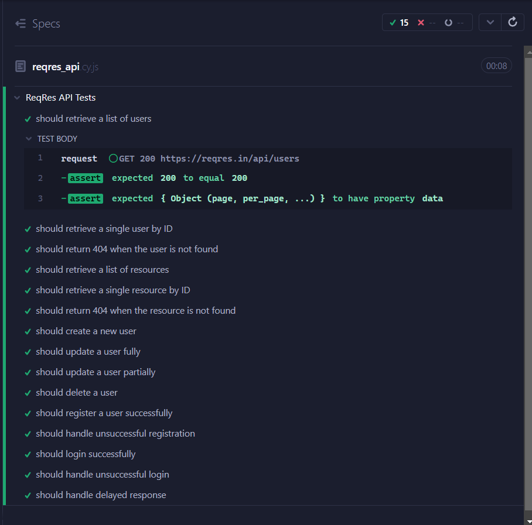

# Cypress ReqRes API Tests

This project tests the ReqRes API using Cypress, ensuring that various endpoints behave as expected. It covers GET, POST, PUT, PATCH, and DELETE requests with different scenarios.

## Installation

1. Clone the repository:

2. Install dependencies:

3. Run Cypress tests:

## Folder Structure

- `cypress/e2e`: Contains the test files.
- `cypress/fixtures`: Stores static test data.
- `cypress/support`: Contains Cypress-specific support files and custom commands.

## Running Tests

Open Cypress Test Runner:

Select the `reqresApi.cy.js` file to run the tests.

## Test Coverage

The test suite covers:
1. Retrieving a list of users.
2. Handling successful and unsuccessful user operations.
3. Resource retrieval and creation.
4. Testing delays and edge cases for invalid inputs.

